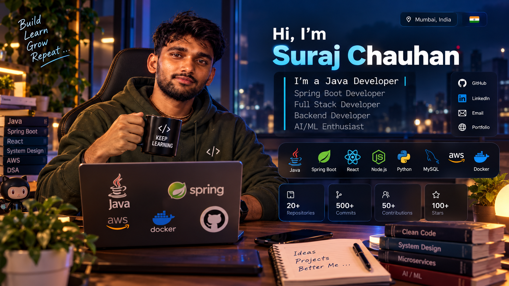

<div align="center">



# 👋 Hi, I'm Suraj Chauhan

### ☕ Java Developer | 🌱 Spring Boot Developer | 🌐 Full Stack Developer


<br>

<a href="https://github.com/chauhansuraj05">

</a>

<a href="https://www.linkedin.com/">

</a>

</div>

---

# 🚀 About Me

Hi! I'm **Suraj Chauhan**, a Computer Science Engineering graduate focused on **Java backend and full-stack development**.

I enjoy building practical applications using **Java, Spring Boot, React, REST APIs, databases, and cloud technologies**.

Currently, I'm strengthening my skills in **Spring Security, Microservices, Docker, AWS, and AI-powered applications** while building projects that help me learn by doing.

---

# 🪪 Developer Profile

<div align="center">

<table>
<tr>

<td width="30%" align="center">

### 🪪 DEVELOPER ID

### Suraj Chauhan

**Java & Full Stack Developer**

📍 Mumbai, India

🎓 B.E. Electronics & Computer Science

🟢 Open to Opportunities

</td>

<td width="40%">

### 👨‍💻 What I Build

I build backend and full-stack applications with a focus on clean APIs, database integration, security, and scalable architecture.

**My current focus:**

- ☕ Java & Spring Boot
- 🔐 Spring Security & JWT
- 🧩 Microservices
- 🗄️ JPA & Hibernate
- ⚛️ React
- ☁️ AWS & Docker
- 🤖 Spring AI & AI/ML

</td>

<td width="30%">

### ⚡ Quick Facts

**👤 Name**  
Suraj Chauhan

**💻 Focus**  
Java / Backend / Full Stack

**📍 Location**  
Mumbai, India

**🎓 Education**  
B.E. Electronics & Computer Science

**🗣️ Languages**  
English • Hindi

**🏃 Hobbies**  
Running • Traveling

</td>

</tr>
</table>

</div>

---

# 🛠️ Tech Stack

<div align="center">

### ☕ Programming Languages


<br><br>

### ⚙️ Backend


<br><br>

### 🎨 Frontend


<br><br>

### 🗄️ Databases


<br><br>

### ☁️ Tools & Cloud


</div>

---

## 🧩 What I Work With

| Category | Technologies |
|---|---|
| 💻 Languages | Java, JavaScript, Python, SQL |
| ⚙️ Backend | Spring Boot, Spring MVC, Spring Security, Node.js, Express.js |
| 🌐 Frontend | React, HTML, CSS, JavaScript |
| 🗄️ Database | MySQL, PostgreSQL, MongoDB |
| 🧩 Architecture | REST APIs, Microservices |
| 🔐 Security | Spring Security, JWT |
| ☁️ Cloud & DevOps | AWS, Docker, Git, GitHub, Maven |
| 🤖 AI | AI/ML, Spring AI, RAG, Agentic AI |

---

# 🚀 Featured Projects

<div align="center">

<table>
<tr>

<td width="50%">

## 🛒 ShopSphere

### E-Commerce Microservices

A full-stack e-commerce application built with a microservices architecture.

**Tech Stack**

`Java` `Spring Boot` `React`

`PostgreSQL` `Spring Security` `JWT`

`Docker` `AWS`

**Key Features**

- 🔐 Authentication & Authorization
- 👤 User Management
- 🛍️ Product Management
- 🛒 Shopping Cart
- 📦 Order Management
- 🔗 REST APIs
- 🧩 Microservices Architecture

</td>

<td width="50%">

## 📚 Library Management System

### Full Stack Application

A library management application for managing books, users, and library operations.

**Tech Stack**

`Java` `Spring Boot` `React`

`MySQL` `JPA/Hibernate`

`REST API`

**Key Features**

- 📖 Book Management
- 👤 User Management
- 🔍 Book Search
- 📚 Library Operations
- 🔗 REST APIs
- 🗄️ Database Integration

</td>

</tr>

<tr>

<td width="50%">

## ⚡ Electricity Billing System

### Java Desktop Application

A Java Swing application for customer management and electricity billing.

**Tech Stack**

`Java` `Swing` `JDBC` `PostgreSQL`

**Key Features**

- 👤 Customer Management
- ⚡ Electricity Billing
- 🧾 Bill Generation
- 🗄️ PostgreSQL Database
- 🔐 Login System

</td>

<td width="50%">

## 🥦 Grocery Inventory System

### Inventory Management

An application for managing grocery products and inventory.

**Tech Stack**

`Java` `JDBC` `MySQL`

**Key Features**

- 📦 Product Management
- 💰 Product Details
- 📊 Inventory Management
- 🗄️ Database Integration

</td>

</tr>
</table>

</div>

---

# 📌 Development Focus

```text
🧩 Backend Development
        ↓
☕ Java & Spring Boot
        ↓
🔗 REST APIs
        ↓
🗄️ Database Management
        ↓
🔐 Spring Security & JWT
        ↓
🧩 Microservices
        ↓
🐳 Docker & AWS
        ↓
⚛️ Full Stack Applications
        ↓
🤖 AI-Powered Applications
